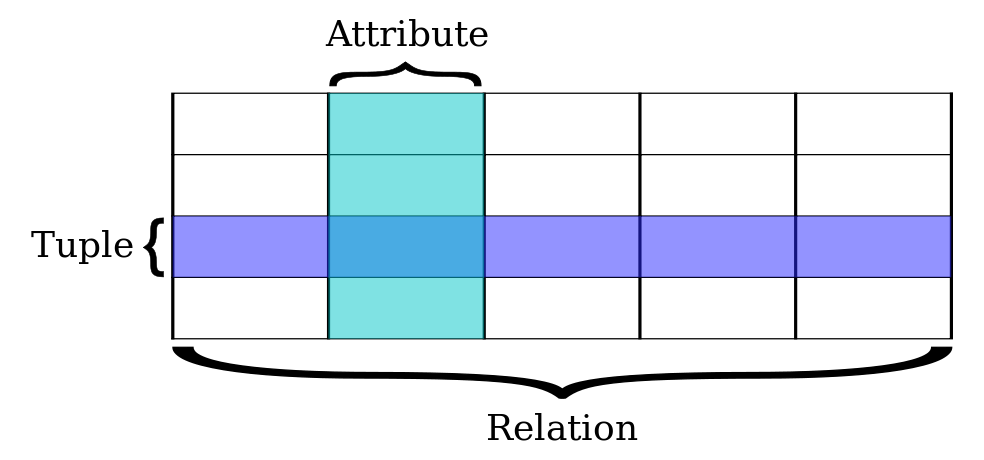
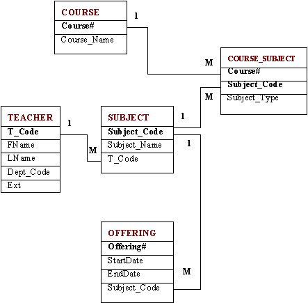
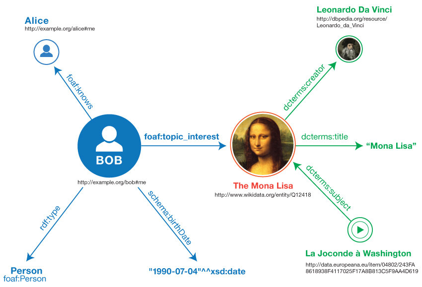

# 
Unit 1 = bag of words

Unit 2 = relationships

# tabular data
<table>
<tbody>
<tr>
<th>Name</th>
<th>Species</th>
<th>Breed</th>
</tr>
<tr>
<td>Huxley</td>
<td>Felis catus</td>
<td>Domestic tabby</td>
</tr>
<tr>	
<td>Orwell</td>
<td>Felis catus</td>
<td>Domestic demon</td>
</tr>
<tr>
<td>Harper</td>
<td>Canis lupus familiaris</td>
<td>Flat coat retriever</td>
</tr>
<tr>
<td>Biscuit</td>
<td>Canis lupus familiaris</td>
<td>Corgi</td>
</tr>
</tbody></table>

#


<div id="citation">Image credit: https://en.wikipedia.org/wiki/Relational_database</div>

# 


<div id="citation">Source: https://www.dlsweb.rmit.edu.au/toolbox/knowmang/content/models/relational_model.htm</div>

#


<div id="citation">Source: http://legacy.alexandria.ucsb.edu/gazetteer/ContentStandard/version3.2/GCS3.2-guide.htm</div>

# Data modeling
* [Ancient Graffit](http://ancientgraffiti.org/Graffiti/graffito/AGP-EDR140141)
* [Atlantic Current](http://katherinedau.com/atlanticcurrent/)
* [Mapping the Scottish Reformation](http://katherinedau.com/atlanticcurrent/)

# Structured Query Language

# SQL

```
SELECT column_name,column_name
FROM table_name
WHERE column_name operator value;
```

```
SELECT * FROM pets
WHERE species='cat';
```

# Data types
* String/characters = "String!"
* Integer = 4
* Decimal = 4.10 
* Boolean (T/R) = TRUE
* Date = 2019-10-20 
* Time = HH:MM:SS

# File formats
* .csv = comma separated value
* .xlsx = Excel workbook
* .tsv = tab separated value
* .json = Javascript Object Notation
* .xml = Extensible Markup Language
* RDF = resource description framework


# The Dream of Linked Data

# Facts
* Computers only do what we tell them.
* The web knows what we said, not what we mean.
 
# 
```
<lg type="sestina">
<lg type="sestet" rhyme="ababab">
<l>I saw my soul at rest upon a <rhyme label="a" xml:id="A">day</rhyme></l>
<l>As a bird sleeping in the nest of <rhyme label="b" xml:id="B">night</rhyme>,</l>
<l>Among soft leaves that give the starlight <rhyme label="a" xml:id="C">way</rhyme></l>
<l>To touch its wings but not its eyes with <rhyme label="b" xml:id="D">light</rhyme>;</l>
<l>So that it knew as one in visions <rhyme label="a" xml:id="E">may</rhyme>,</l>
<l>And knew not as men waking, of <rhyme label="b" xml:id="F">delight</rhyme>.</l>
</lg>
```
<div id="citation">Source: http://prosody.lib.virginia.edu/<div>

# so what
 

# Open Graph Protocol
``` 
<html prefix="og: http://ogp.me/ns#">
<head>
<title>The Rock (1996)</title>
<meta property="og:title" content="The Rock" />
<meta property="og:type" content="video.movie" />
<meta property="og:url" content="http://www.imdb.com/title/tt0117500/" />
<meta property="og:image" content="http://ia.media-imdb.com/images/rock.jpg" />
...
</head>
...
</html>

```
<div id="citation">Source: http://ogp.me/</div>

# Activity 3 / Open Graph

# Google's How Search Works
<a href="https://www.google.com/search/howsearchworks/">https://www.google.com/search/howsearchworks/</a>

# Google
* What do we know about Google? 
* What can we learn? 
* What concerns do we have? 

# Try it
In Google, search for the following: `site:yourURL.com`

# Knowledge-based Trust
<a href="http://acrl.ala.org/techconnect/post/removing-the-truthiness-from-google">Removing the Truthiness from Google</a>

# How can we declare facts? 
Subject > Predicate > Object 

# Triples
1. W&L > located in > Lexington 
2. JK Rowling > wrote > Harry Potter
3. Luke > knows > Luke

# Problem! 
Luke > knows > Luke 

# Disambiguation solved

http://viaf.org/viaf/76391491 > http://schema.org/creator > http://www.worldcat.org/oclc/972362520</td>

# 

<div id="citation">Source: https://www.w3.org/TR/rdf11-primer/
</div>

# RDF

Resource Description Framework (RDF) extends the linking structure of the Web to use **URIs** to name the relationship between things as well as the two ends of the link (this is usually referred to as a **“triple”)**. Using this simple model, it allows structured and semi-structured data to be mixed, exposed, and shared across different applications.

<div id="citation">Source: https://www.w3.org/RDF/</div>

# RDF 

This linking structure forms a **directed, labeled graph**, where the edges represent the named link between two resources, represented by the graph nodes. This graph view is the easiest possible mental model for RDF and is often used in easy-to-understand visual explanations.

<div id="citation">Source: https://www.w3.org/RDF/</div>

# unit 2 data

# Open Refine

# Data Assessment 
