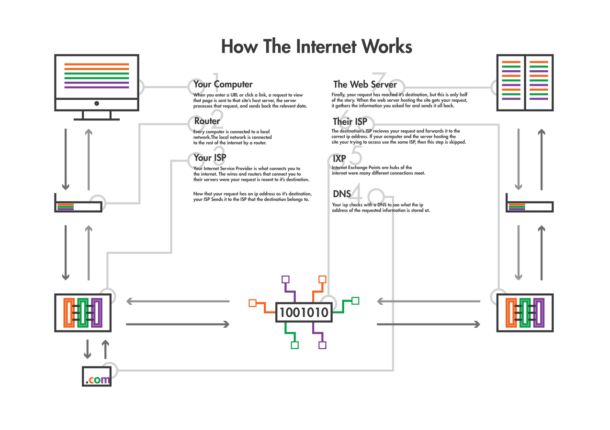

# agenda
* ice breaker
* readings
* break
* how the web works
* HTML + CSS 

# ice breaker
What did you wish you knew as a first-year? 

# readings
* 2-3 main points of the article
* 1 thing you didn't quite understand
* 1 question for the rest of the class to answer

////

1. Digital_Humanities, pages 3-16
2. Digital_Humanities, pages 16-26
3. "The Limits of the Digital Humanities"
4. "Defining Data for Humanists" + "What is Data"


# D_H, pp. 1-16
* "humanities" as traditionally text-based disciplines
* "generative humanities" - we're making things now
* digitization of print cultural record > changes learning
* digital environment brings new conventions, need for standards, and a focus on design
* DH not a replacement for "traditional knowledge skills and methods"
* interfaces are important, but they can change, even with the same data

# D_H, pp. 16-26
* computation depends on disambiguation at every level
* core activities: curation, analysis, modeling, editing
* humanistic values affect digital environments/structures
* versioning, prototyping, and FAILURE
* value of humanities? 

# D_H, projects
* [Perseus](http://www.perseus.tufts.edu/hopper/)
* [Valley of the Shadow](http://valley.lib.virginia.edu/), [Ed Ayers talk](https://livestream.com/wlu/edward-ayers)
* [Women Writers Project](http://wwp.northeastern.edu/)

# "Limits"
* DH suffers from an identity crisis
* DH is overstating the effect the "digital"
* DH makes assumptions and observations that aren't grounded in facts
* DH seeks to make traditional humanities obsolete
* DH tools are only good for "understanding things in mass," they still require a knowledgeable scholar to ask the right questions
* DH should resist and critique the digital

# "Defining Data" + "What is Data"	
* Data is an artifact
* Data can be interpreted as texts
* Data can be computed/processed
* Data is not evidence on its own, but can be used as evidence
* Humanists can use their own skill-set and apply it to data

# 
<a href="https://thenextweb.com/insider/2015/02/16/ways-people-described-computers-1990s-hilarious/"></a>

# goals
* update our mental model of the internet
* understand the syntax of code
* learn how to use documentation
* make our hand-crafted websites live for the world to see! 

# 

Credit: now defunct <a href="http://www.justinrominedesign.com/">http://www.justinrominedesign.com/</a>

# proof!
On a Mac:
```
* Type cmd + space to open Spotlight search
* Type "terminal" and hit enter
* Type "traceroute www.yourdomain.com"
* Type Control + C to cancel
```


On Windows:
```
* Search for "cmd.exe" program and open it.
* Type "tracert www.yourdomain.com"
* Type Control + C to cancel
```

# more proof!
* <a href="http://www.submarinecablemap.com">http://www.submarinecablemap.com</a>
* <a href="https://acrl.ala.org/techconnect/post/what-should-academic-librarians-know-about-net-neutrality/">net neutrality post</a>

# glossary
* URL = Uniform Resource Locator
* TLD = top level domain 
* DNS = Domain Name System
* HTTP = Hypertext Transfer Protocol
* FTP = File Transfer Protocol
* IP = Internet Protocol
* TCP = Transmission Control Protocol

# 
<a href="https://xkcd.com/1053/"></a>

# HyperText Markup Language

# HTML
Composed of *elements* that semantically markup a document.

# HTML
[how did we get here?](https://diveintohtml5.info/past.html)

# HTML
```
<!DOCTYPE html>
<html>
<head>
<title>Page Title</title>
</head>
<body>

<h1>My First Heading</h1>
<p>My first paragraph.</p>

</body>
</html> 
```

# Cascading Style Sheets
```
body {
    background-color: #d0e4fe;
}

h1 {
    color: orange;
    text-align: center;
}

p {
    font-family: "Times New Roman";
    font-size: 20px;
}
```

# Activities
Complete activities 3-5 in Unit 0. 

# For Thursday 
* readings
* look over *Programming Historian* lessons
* finish up activities 3-5


