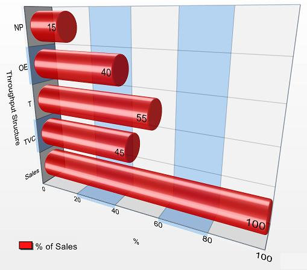

# data visualization 
> A method of deforming, compressing, or otherwise manipulating data in order to see it in new and enlightening ways. A good visualization can turn hours of careful study into a flash of insight, or can convey a complex narrative in a single moment.  

- Historian's Macroscope

# But... 
> Visualizations can also lie, confuse, or otherwise misrepresent if used poorly.  

Historian's Macroscope

# what makes bad data viz?

#

# 

# what makes good data viz?
* appropriate chart type
* reasonable colors
* labels/legend
* but not too crowded
* scaled for data 

# Data Viz Examples
* [http://www.datavizcatalogue.com](http://www.datavizcatalogue.com/)
* [https://pudding.cool/](https://pudding.cool/)
* [http://www.informationisbeautiful.net/](http://www.informationisbeautiful.net/)

# Activity 4

# Teams
|team 1|team 2|team 3|team 4|
|---|---|---|---|
|Liza, Ally, Maggie, Julie|Mary Mack, Wes, Tate, Madison |Edwin, Hannah, Alex, Marissa |Liv, Eli, Rose, Lilly|

# Text analysis tools
* [AntConc](http://www.laurenceanthony.net/software/antconc/) (team 1)
* [Topic Modeling Tool](https://senderle.github.io/topic-modeling-tool/documentation/2017/01/06/quickstart.html) and/or Mallet (team 2)
* [Lexos](http://lexos.wheatoncollege.edu/) (team 3)
* [Voyant](http://voyant-tools.org/) (team 4)

# Evaluation questions
* Who created this tool?
* What documentation is available?
* How do you input/output data? 
* What visualization options are available? 
* What types of questions does this tool enable?

# Project planning 
1. What is my research question or topic?
2. What are the biggest problems I have found with the data? What are realistic solutions?
3. What methods/tools am I interested in using?
4. What resources do I need?
5. What are my next steps? Break them down!
