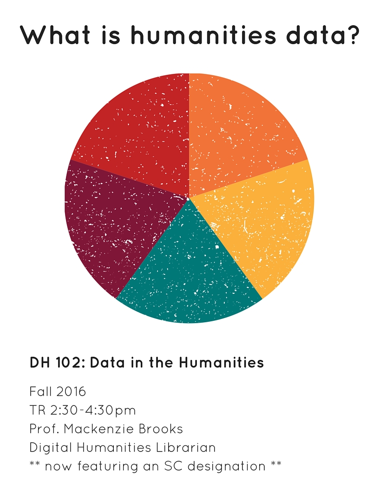

# What is Open Data?
> "Open means anyone can freely *access*, use, modify, and share for any purpose (subject, at most, to requirements that preserve provenance and openness).”


<sub>[http://opendatahandbook.org/guide/en/what-is-open-data/](http://opendatahandbook.org/guide/en/what-is-open-data/)</sub>

# Bar


# More
* List
* List
* List

## more
``` 
code 
```

# Even something else!
That happens on this slide. 